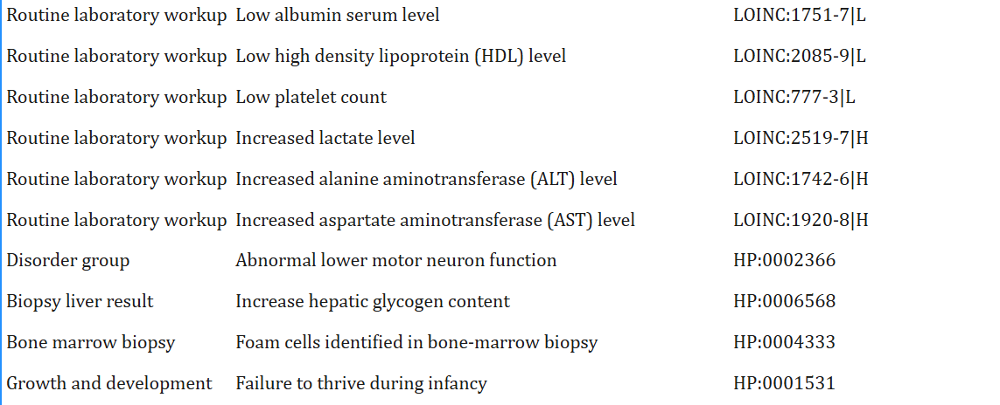

# Phenotype summary (case)

Key findings:
- Hepatosplenomegaly
- Cholestasis / liver dysfunction
- Ascites
- Anemia / thrombocytopenia
- Foam cells in bone marrow
- Increased hepatic glycogen
- Lower motor neuron involvement
- Failure to thrive

Suspected inheritance: Autosomal recessive (AR)

Clinical pattern:
- Multi-organ involvement + storage/metabolic suspicion.
- Focus: lysosomal storage disorders + glycogen metabolism.

Differentials mentioned in source:
- Gaucher, Niemann-Pick, NPC, GSD spectrum

**Genes**

Increase hepatic glycogen content ([text](https://hpo.jax.org/browse/term/HP:0006568))
NCBIGene:5236 PGM1
NCBIGene:2542 SLC37A4
NCBIGene:81858 SHARPIN
NCBIGene:54914 FOCAD
NCBIGene:5261 PHKG2
NCBIGene:5836 PYGL
NCBIGene:208 AKT2
NCBIGene:10667 FARS2
NCBIGene:3172 HNF4A
NCBIGene:2632 GBE1

Foam cells identified in bone marrow [text](https://hpo.jax.org/browse/term/HP:0004333)
NCBIGene:4864 NPC1
NCBIGene:6609 SMPD1
NCBIGene:3988 LIPA
NCBIGene:10577 NPC2
NCBIGene:4758 NEU1

Failure to thrive
Autosomal recessive inheritance

